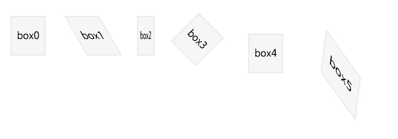

### 任务目的

- 熟悉 CSS transform 各项子属性
- 理解  CSS  transform 2D 变形

### 任务描述

通过 CSS transform 实现如 设计图 中所示效果，要求达到对设计稿的百分百的还原。

[下载设计图源文件](http://jadyoap.bj.bcebos.com/ife%2F%E4%BB%BB%E5%8A%A1%E4%BA%8C%E8%AE%BE%E8%AE%A1%E7%A8%BF.psd)

- 其中，你应当实现的变换效果已经在 Psd 中标明
  

### 任务注意事项

- 注意不同浏览器中的兼容性
- 请注意代码风格的整齐、优雅
- HTML 及 CSS 代码结构清晰、规范
- 代码中含有必要的注释       

### 在线学习参考资料

- [CSS3 新特性兼容方法总结](https://www.cnblogs.com/jesse131/p/5441199.html)
- [CSS3 2D 转换](http://www.w3school.com.cn/css3/css3_2dtransform.asp)
- [CSS Transforms Module](https://www.w3.org/TR/css-transforms-1/)
- [CSS3 中的变形 transform详解](https://www.cnblogs.com/afighter/p/5726888.html)

## 实践方案

这个没什么好说的，就是利用`css3`的`transform`属性即可，如`skewX(Y)`，`scaleX(Y)`，`rotate`，`translate`等；需要注意的是`skew`的错切方向。

怎么感觉设计图的最后一个`box`与说明不符合啊……