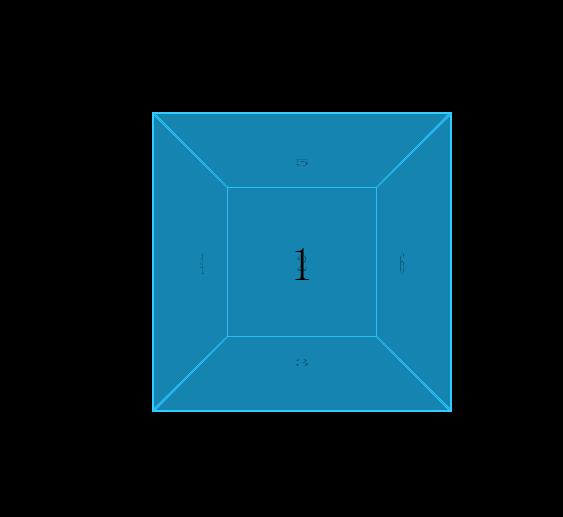

## No.5 - 纯 CSS 制作绕中轴旋转的立方体

### 任务目的

- 学习 CSS animation keyframes
- 理解动画中 关键帧 的概念
- 掌握  CSS  transform 3D 变形

### 任务描述

- 观看视频中的效果 、通过纯CSS 实现一个立方体翻转的效果
    [视频demo](http://jadyoap.bj.bcebos.com/ife%2F%E4%BB%BB%E5%8A%A1%E4%BA%94.mov)
- 要求 hover 的时候， 立方体绕着「通过其中心的纵轴」旋转

### 任务注意事项

- 注意不同浏览器中的兼容性
- 请注意代码风格的整齐、优雅
- HTML 及 CSS 代码结构清晰、规范
- 代码中含有必要的注释       

### 在线学习参考资料

- [CSS3 新特性兼容方法总结](https://www.cnblogs.com/jesse131/p/5441199.html)
- [CodePen 立方体 demo ](https://codepen.io/jordizle/pen/haIdo)
- [CSS3 3D transform 详解](http://www.zhangxinxu.com/wordpress/2012/09/css3-3d-transform-perspective-animate-transition/)
- [CSS Transforms 3D ](http://www.w3school.com.cn/css3/css3_3dtransform.asp)
- [CSS3 @keyframes 规则](http://www.w3school.com.cn/cssref/pr_keyframes.asp)
- [CSS3 过渡](http://www.w3school.com.cn/css3/css3_transition.asp)
- [CSS3 变形](http://www.w3school.com.cn/cssref/pr_transform.asp)
- [CSS Transforms Module](https://www.w3.org/TR/css-transforms-1/)
- [CSS3中的变形 transform详解](https://www.cnblogs.com/afighter/p/5726888.html)

## 实现方案

- 这个案例虽小，但是『五脏俱全』；几乎所有的`transform 3D`属性都能涉及到，关键是需要对`css3`的3D变换模型有系统的了解
- 基本上与计算机图形中的成像原理和坐标变换有关
- 需要注意的是不要把`perspective`属性设置在正方体的容器上，因为当正方体容器旋转时，会出现意想不到的结果！因此需要在正方体容器外面再加一层，然后在该元素上设置`perspective`属性，因而正方体整体旋转的时候不会透视效果不会受到干扰！
- 由于需要绕立方体的正中心所在的`Y`轴进行旋转，所以需要把中心点的`z`坐标也要设置到中点！

### 3D坐标系

在浏览器中，一般二维坐标系的原点为左上角，而三维坐标系`z`轴的方向是由屏幕向外增大的，除此之外`x`轴和`y`轴的方向与二维坐标系无异。所以屏幕所在平面就相当于`z=0`平面。

### perspective

`perspective`属性的值相当于视点离屏幕的距离，距离越远则成像的效果越接近于平行投影，也就是越没有立体效果，反之则更具有立体效果；

一般要体现出立体效果，还需要结合`translateZ`来对元素的`z`坐标进行控制；

### transform-style

通过设置`transform-style`的属性，可以控制其**子元素**的呈现方式，也就是投影方式。当属性为`flat`（默认值）时，其子元素为`2D`呈现，即平行投影；当属性为`preserve-3d`时，为`3D`呈现，即透视投影。由于其作用在其子元素上，所以一般用来当做立体容器来使用。

### transform-origin

顾名思义，`transform-origin`属性就是用来设置元素的坐标中心位置，而`transform`的变换需要依靠坐标中心。其默认值为`center center`，即元素的正中心；而在三维变换中，还有另一个`transform-origin-z`属性用来设置中心点的`z`轴坐标，其默认值为`0`，即屏幕平面；`transform-origin-z`属性目前只有谷歌浏览器支持，所以需要加`-webkit`前缀。不过，`transform-origin`是可以接受第三个参数的，其默认值也是`0`！

参数值：

|   值   |                             描述                             |
| :----: | :----------------------------------------------------------: |
| x-axis | 定义视图被置于 X 轴的何处。可能的值： 	 	left 	center 	right 	*length* 	*%* |
| y-axis | 定义视图被置于 Y 轴的何处。可能的值： 	 	top 	center 	bottom 	*length* 	*%* |
| z-axis |   定义视图被置于 Z 轴的何处。可能的值： 	 	*length*    |

### 效果图

## 参考文档

1. [CSS3 transform-origin 属性](http://www.w3school.com.cn/cssref/pr_transform-origin.asp)
2. [CSS3 Transform-3D空间变换成像原理浅析 - w3ctech](https://www.w3ctech.com/topic/833)

